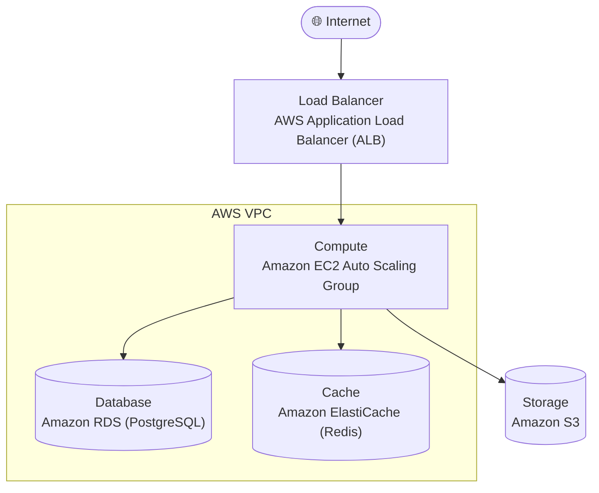

# ตัวอย่าง Architecture Diagram (สร้างอัตโนมัติ)

เอกสารนี้แสดงตัวอย่างผลลัพธ์ของฟังก์ชัน `generate_architecture_diagram()`
ที่แปลงผลลัพธ์จาก Architecture Agent เป็นแผนภาพ Mermaid โดยอัตโนมัติ
GitHub จะ render โค้ดด้านล่างเป็นรูปภาพให้เองทันที

## เอกสารที่เกี่ยวข้อง

- [Architecture](./architecture.md)
- [Agent Pipeline (โค้ด)](../agents/orchestrator.py)
